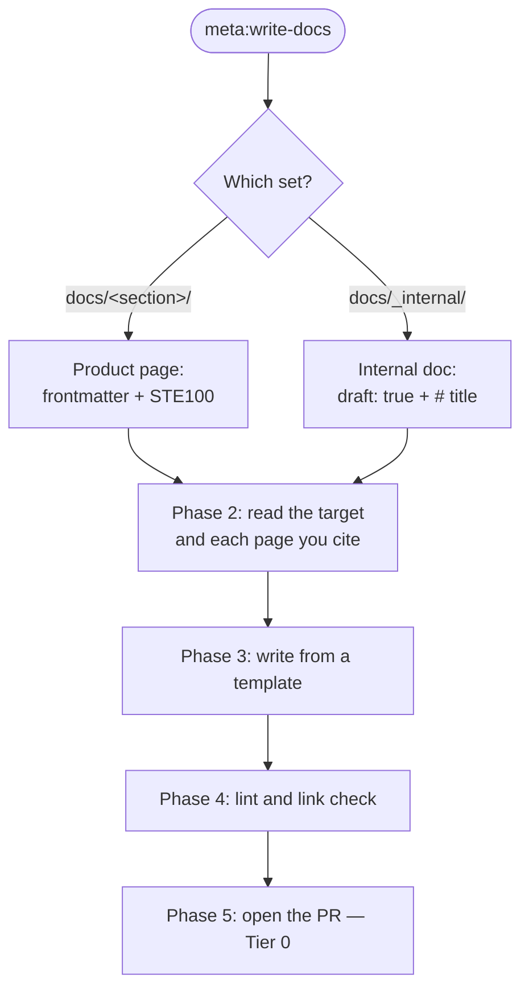

> Follow this diagram as the workflow.

# Write documentation

The authoritative rules are in
[docs/_internal/docs-contributor-guide.md](../../../docs/_internal/docs-contributor-guide.md). Read
that file first. This skill gives the workflow, and it does not repeat the rules.

## Table of Contents

- [When to Use](#when-to-use)
- [Phase 1: Identify the set](#phase-1-identify-the-set)
- [Phase 2: Read before you write](#phase-2-read-before-you-write)
- [Phase 3: Write the page](#phase-3-write-the-page)
- [Phase 4: Check the page](#phase-4-check-the-page)
- [Phase 5: Open the pull request](#phase-5-open-the-pull-request)
- [Errors to Avoid](#errors-to-avoid)
- [Internal Design Documents](#internal-design-documents)
- [Related Skills](#related-skills)

## When to Use

- A code change needs a documentation change (Pillar 2 of `FEATURE_ACCEPTANCE.md`).
- A new page is needed under `docs/`.
- A reader reported that a page is wrong, or that a page is missing.

## Phase 1: Identify the set

The two sets have different rules. Read the target path.

| Path | Set | Frontmatter | Body |
| --- | --- | --- | --- |
| `docs/<section>/*.md` | Product, published to rossoctl.dev | `title`, `description`, `sidebar_position` | No `#` heading. The title comes from the frontmatter. |
| `docs/_internal/*.md` | Internal, not published | `draft: true` | Start with a `#` title. |

For a product page, select the section by the reader. The table in the
[contributor guide](../../../docs/_internal/docs-contributor-guide.md#where-content-lives) gives one
reader for each section.

If no section fits the change, stop. Report this to the user, and propose an issue. Do not add a
section.

## Phase 2: Read before you write

Read these files, and do not write from memory:

1. The target page, complete.
2. **Each page that you will link to.** Your claim must agree with that page, and must use its words.
3. `docs/concepts/index.md`, for the maturity of each feature (Ready, Beta or Alpha).
4. `docs/reference/glossary.md`, for the term to use.
5. The code, the command output, or the pull request that gives the behaviour.

```bash
# The maturity and the default of each feature
sed -n '20,60p' docs/concepts/index.md

# Every page that links to the page you change (a change here can break their claims)
grep -rn "$(basename <target>.md)" --include="*.md" docs
```

If the behaviour is not released, do not document it as current. Add a comment instead:

```markdown
<!-- VERIFY v0.9.0: confirm this claim once #901 lands. -->
```

## Phase 3: Write the page

Copy the template for the page type from the
[contributor guide](../../../docs/_internal/docs-contributor-guide.md#page-templates): a task page, a
concept page, an experiment page, or a reference page.

Write in ASD-STE100. The six rules that matter most:

1. One instruction in one sentence. Approximately 20 words.
2. Present tense, and active voice.
3. Address the reader as "you". Do not write "we".
4. No contraction, no "please", no "simply", no "easily", no "just".
5. One word for one meaning, from the glossary.
6. Give the maturity and the default of a feature: "experimental", "off by default".

A concept page leads with the value, then the installation, then the architecture. A task page gives
numbered steps, and each step gives one command.

## Phase 4: Check the page

Run the two tools that Docs CI runs. Fix each issue before you report the work as complete.

```bash
# 1. Markdown lint (the repository configuration is .markdownlint-cli2.yaml)
npx markdownlint-cli2 "docs/**/*.md"

# 2. Relative links in the changed files (the gating pass in Docs CI).
#    lychee is a separate binary: brew install lychee, or cargo install lychee.
lychee --offline --config .lychee.toml \
  $(git diff --name-only --diff-filter=d main...HEAD -- '*.md')
```

Then verify by hand:

- Each anchor that you link to is a heading in the target file. `.lychee.toml` excludes
  `docs/_internal/` and `.claude/`, so a link in one of those files needs a manual check.
- Each command in the page runs, and the output in the page is the output that you saw.
- Each claim agrees with the page that you cite. Open the page and compare the words.

## Phase 5: Open the pull request

- A documentation-only change is **Tier 0**. State the tier in the pull request.
- Sign off each commit: `git commit -s`.
- In the body, give the reader, the change, and the reason. Name each page that you moved or renamed.
- If you removed a claim, say which page contradicted it.

## Errors to Avoid

Each error below is from a real review.

| Error | Correction |
| --- | --- |
| A claim contradicts the page that it links to. | Read the target page, and copy its words. See [#2564](https://github.com/rossoctl/rossoctl/pull/2564). |
| An Alpha feature is given as current behaviour. | Add `:::warning Alpha`, and write "off by default". |
| Behaviour from an open issue is documented as released. | Remove the claim, or add a `VERIFY` comment. |
| A token count or a cost is given for each call. | Only a model call has a token count and a cost. |
| A `#` title is in the body of a product page. | Delete it. The frontmatter `title` gives the heading. |
| A blockquote is used for a callout. | Use `:::note` or `:::warning`. |
| A manual table of contents is in a product page. | Delete it. Docusaurus builds the table of contents. |
| A serial comma is used. | The pages write "A, B and C". |

## Internal Design Documents

A file under `docs/_internal/` is a contributor document. The rules above for frontmatter and for
`#` titles do not apply. Use this structure:

- `draft: true` in the frontmatter, with the comment `# excluded from https://www.rossoctl.dev/`.
- A `#` title, then one paragraph that gives the subject and the reader.
- A table of contents for a file of more than 50 lines.
- Mermaid for a flow, a sequence or a state machine. ASCII art for a cluster layout or a namespace
  layout.
- A language tag on each code block, and only the relevant fields of a manifest.

A design document or a specification goes in `docs/_internal/design-proposals/` or
`docs/_internal/superpowers/specs/`. Tier 2 needs one. See `FEATURE_ACCEPTANCE.md`.

## Related Skills

- `docs:review` — review a documentation pull request against these rules.
- `skills:write` — write a skill. A skill is not documentation.
- `git:commit` — commit with a DCO sign-off.
