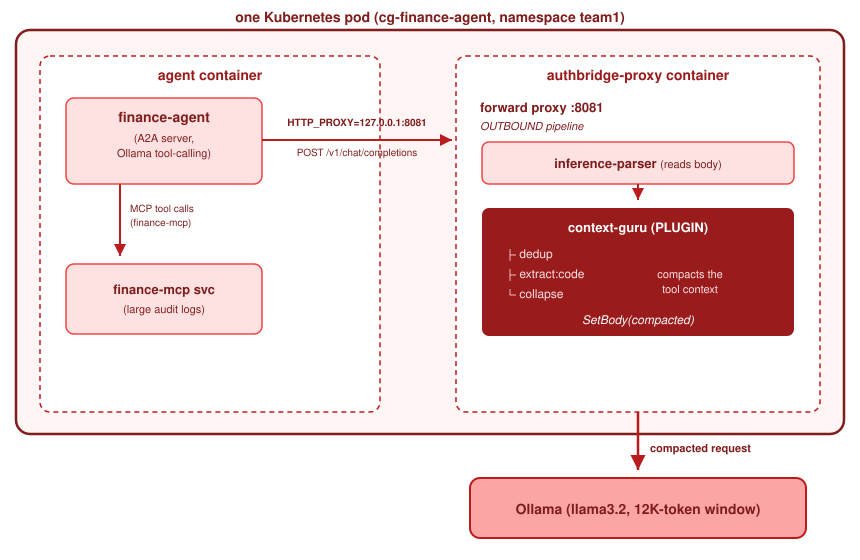

# Context-guru

Context-guru is a [Rossoctl Cortex](https://github.com/rossoctl/cortex) plugin that compacts an
agent's growing tool-output context before it reaches the LLM, so a task whose
raw context **exceeds the model's window** still fits — and the agent gets the
right answer *because of* the compaction.

Same agent, same model, same window. The only variable is context-guru:

| mode | context-guru | request the model sees | agent answer |
|------|-------------|------------------------|--------------|
| **off** | disabled (kill-switch) | raw **~18K tok** → **truncated** to the 12K window | ❌ misses the anomaly, hallucinates a wrong refund |
| **observe** | shadow (measures, doesn't apply) | raw ~18K tok (truncated); logs it *would* save 52KB→30KB | ❌ same wrong answer — proves the measurement is free |
| **enforce** | applied | compacted **~10K tok** → **fits** | ✅ finds the TX4827 duplicate, clears the others |

## Architecture

context-guru is an **in-process AuthBridge plugin** (not a sidecar service). The
agent's outbound LLM calls are routed through AuthBridge's forward proxy
(`HTTP_PROXY=:8081`); the plugin runs in the **outbound** pipeline and rewrites
the request body before it leaves the pod.

<!--
The SVG is based on this ASCII art.  To edit the SVG, edit this art and ask a tool to regenerate SVG.
```
             one Kubernetes pod (cg-finance-agent, namespace team1)
 ┌──────────────────────────────────────────────────────────────────────────┐
 │  agent container                    authbridge-proxy container           │
 │  ┌───────────────┐  HTTP_PROXY      ┌─────────────────────────────────┐  │
 │  │ finance-agent │  =127.0.0.1:8081 │  forward proxy :8081            │  │
 │  │  (A2A server, │ ────────────────▶│    │ OUTBOUND pipeline          │  │
 │  │  Ollama tool- │  POST /v1/chat/  │    ▼                            │  │
 │  │  calling)     │  completions     │  inference-parser  (reads body) │  │
 │  └──────┬────────┘                  │  context-guru      (PLUGIN)     │  │
 │         │ MCP tool calls            │    ├ dedup      ─┐              │  │
 │         │ (finance-mcp)             │    ├ extract:code│ compacts the │  │
 │         ▼                           │    └ collapse   ─┘ tool context │  │
 │   finance-mcp svc                   │        │ SetBody(compacted)     │  │
 │   (large audit logs)                └────────┼────────────────────────┘  │
 └──────────────────────────────────────────────┼───────────────────────────┘
                                               ▼  compacted request
                                    Ollama  (llama3.2, 12K-token window)
```

-->



The pipeline is `inference-parser → context-guru`. context-guru is the single
outbound `WritesBody` plugin (mutually exclusive with `sparc`).

See the [Cortex](https://github.com/rossoctl/cortex) repo for details and architecture.
