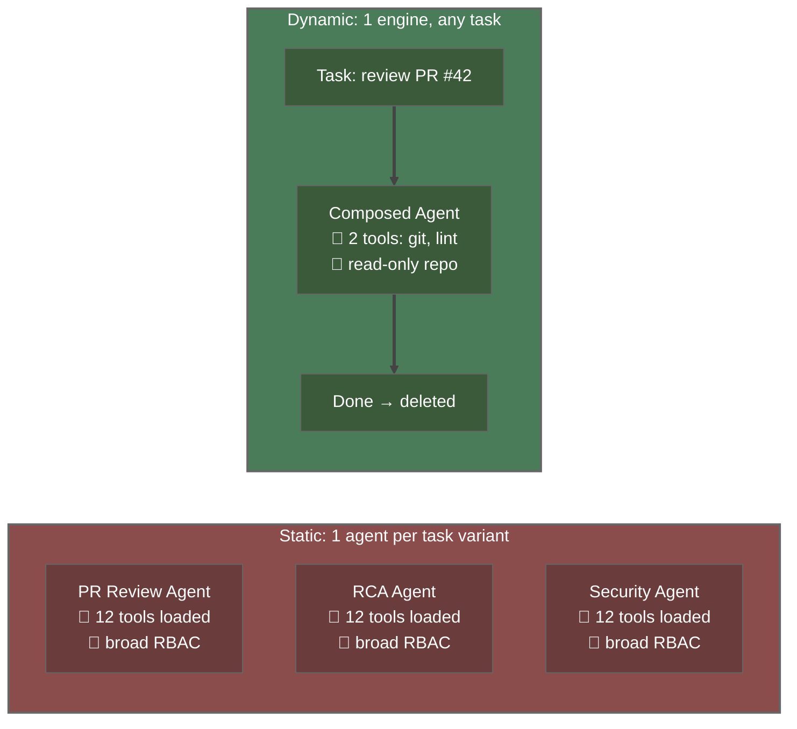
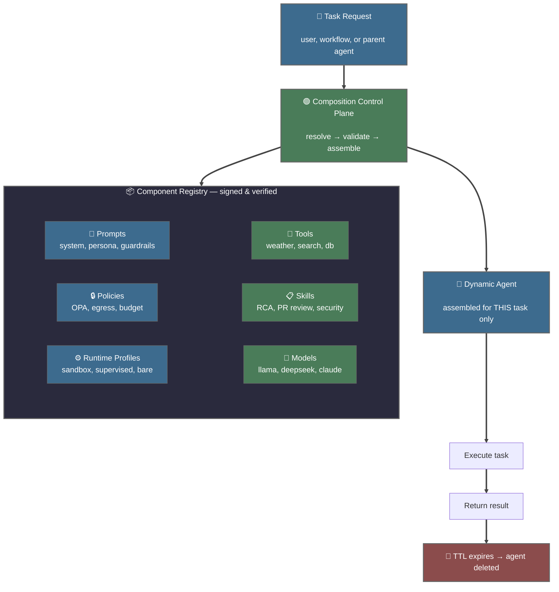
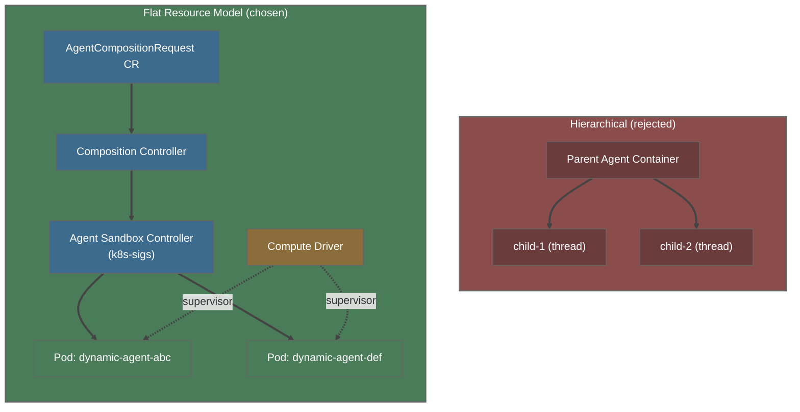
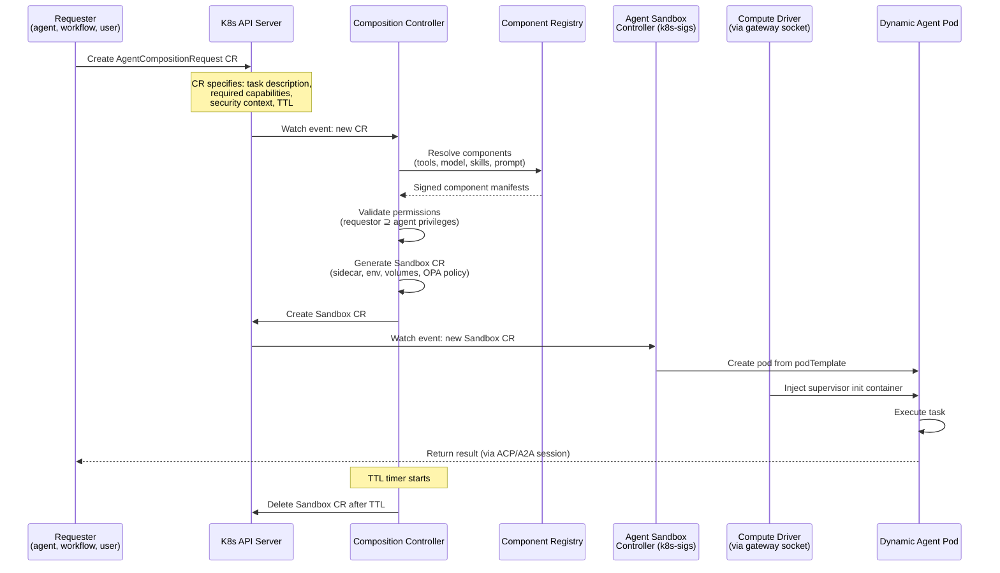
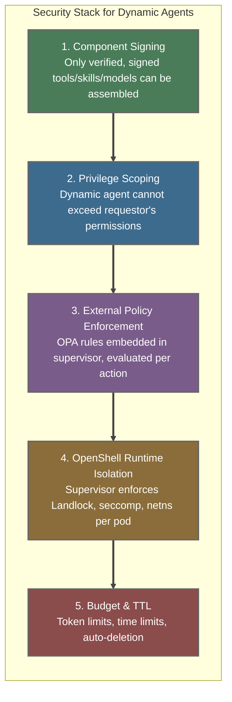
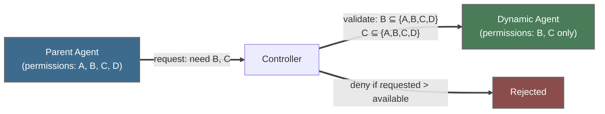
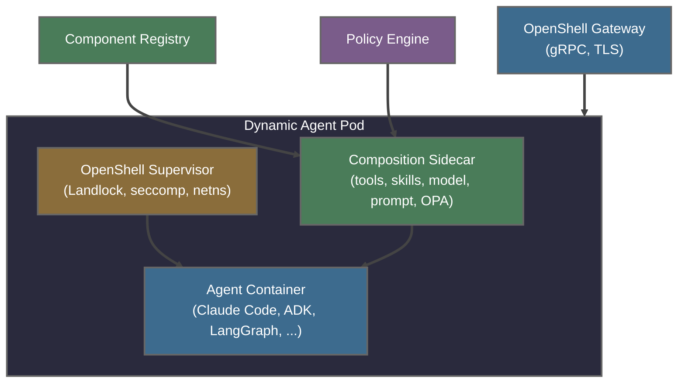
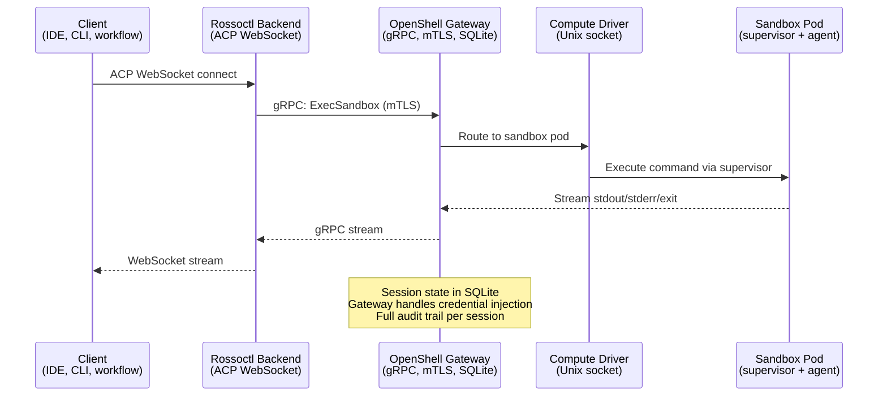
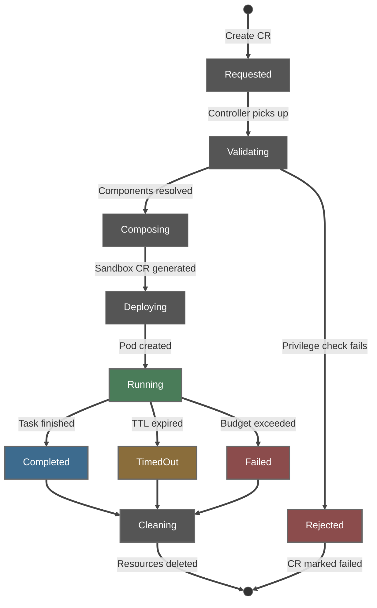

# Composable Agents: Kubernetes-Native Dynamic Agent Architecture

*On-demand assembly of task-specific agents from verified components —
governed, observable, and least-privilege by design.
Built on OpenShell's sandbox runtime for full workload isolation.*

> **Companion doc**: [Session Teleport & Management](session-teleport-and-management.md) —
> the implementation layer that uses this design for context packaging,
> session backup/restore, cross-harness migration, and the test matrix.

---

## The Problem: Static Agents Don't Scale

Static agents are predefined workloads — fixed combinations of model, prompt,
tools, skills, and permissions deployed in advance. They work well for stable
use cases but create fundamental tensions as platforms grow:

| Problem | Static Agent | Dynamic Agent |
|---------|-------------|---------------|
| **Privilege scope** | All tools loaded, broad permissions | Only tools needed for this task |
| **Attack surface** | Large (unused tools exploitable) | Minimal (nothing extra loaded) |
| **Auditability** | Hard (which tool was actually used?) | Clear (agent = one task, one audit trail) |
| **Scalability** | N agents for N task types | 1 composition engine for any task |
| **Cost** | Always running, always allocated | Ephemeral, pay only for execution |

---

## The Solution: Dynamic Agent Composition

Instead of deploying a permanent agent for every scenario, the platform
assembles the **minimum sufficient agent** at runtime from approved components:

The composition control plane translates task requirements into an authorized
assembly of exactly the components needed — no more, no less.

---

## Architecture: Flat Resource Model

### Why Not Hierarchical Spawning?

Most prototypes (including Claude Code's subagents) use in-process spawning —
the parent agent creates child agents as threads or subprocesses inside its
own container. This is simple but breaks enterprise requirements:

Each dynamic agent is a **separate Kubernetes pod** created by the
agent-sandbox-controller and hardened by the OpenShell compute driver
(supervisor injection), with:
- Its own ServiceAccount and RBAC
- Its own resource limits (CPU, memory, ephemeral storage)
- Its own network policy and egress rules (OPA via supervisor)
- OpenShell supervisor enforcing Landlock, seccomp, and network namespace isolation
- Full visibility in `kubectl`, monitoring, and audit logs
- TTL-based lifecycle management (no zombie accumulation)

### Control Plane Flow

Today's pod creation involves two components that must coordinate:
the **agent-sandbox-controller** (kubernetes-sigs, watches Sandbox CRs and creates
pods) and the **OpenShell compute driver** (injects supervisor init containers
via gateway Unix socket). A known race condition exists where both create
Services for the same pod (rossoctl#1581). The composition controller must
orchestrate both and handle this coordination:

---

## Security: Least Privilege by Construction

Dynamic agents are inherently more secure than static agents because they
are assembled with **only** what the task requires:

### Privilege Propagation

The critical constraint: a dynamic agent **never exceeds** the privileges
of the entity that requested it.

---

## Creating Dynamic Agents: The Sidecar Pattern

Different agent frameworks (Claude SDK, ADK, LangGraph, CrewAI) have
different harness requirements. A **sidecar proxy** decouples the
composition engine from framework-specific details:

The sidecar handles:
- **Tool injection**: Mounting MCP server configs into the agent's filesystem
- **Skill loading**: Copying skill definitions to `.claude/skills/` or equivalent
- **Model routing**: Setting `OPENAI_API_BASE` / `ANTHROPIC_BASE_URL` to the correct LiteLLM endpoint
- **Prompt templating**: Injecting system prompts via environment or file mount
- **Policy composition**: Assembling OPA rules from component requirements into supervisor config

OpenShell provides the runtime foundation beneath the sidecar:
- **Gateway**: gRPC entry point with TLS, session state in SQLite, delegates to drivers via Unix socket
- **Compute driver**: Injects supervisor binary as init container into pods created by the
  agent-sandbox-controller (communicates with gateway via `/run/drivers/compute.sock`)
- **Credentials driver**: Exchanges OIDC tokens via Keycloak for sandbox authentication
- **Supervisor binary**: Injected as init container, enforces Landlock filesystem restrictions,
  seccomp syscall filtering, network namespace isolation, and embedded OPA policy evaluation
  (via `--policy-rules` and `--policy-data` flags — not a separate sidecar)
- **Sandbox base images**: Pre-built container images (`ghcr.io/nvidia/openshell-community/sandboxes/base`)
  for ad-hoc sandboxes; agent-specific images built on top for production deployments

---

## Interaction: Session-Based Protocol

All agent access — interactive (SSH/terminal) and programmatic (ACP WebSocket) —
routes through the OpenShell gateway. The Rossoctl backend bridges ACP WebSocket
to the gateway's `ExecSandbox` gRPC, providing a unified session layer with
mTLS, credential injection, and audit logging:

---

## Lifecycle: From Request to Deletion

---

## Design Principles

1. **Composition over configuration** — don't configure a big agent, compose a small one
2. **Flat over hierarchical** — every agent is a K8s pod (via Sandbox CR), not a subprocess
3. **External policy** — governance lives outside the agent process
4. **Signed components** — only verified tools, skills, models can be assembled
5. **Least privilege by construction** — dynamic agent gets exactly what it needs
6. **Session abstraction** — orchestrators use sessions, not pod details
7. **TTL by default** — dynamic agents are ephemeral, not persistent
8. **Observable by default** — OTel traces, structured logs, audit trail per agent

---

*This document defines the composable agents architecture. For the
implementation layer — teleport, session management, backup/restore,
cross-harness migration, and the test matrix — see
[Session Teleport & Management](session-teleport-and-management.md).*
