# Kubernetes-Native Architecture for Dynamic Agent Composition

*Extending Rossoctl with on-demand, task-specific agent assembly from
verified components — governed, observable, and least-privilege by design.
Built on OpenShell's sandbox runtime for full workload isolation.*

---

## The Problem: Static Agents Don't Scale

Static agents are predefined workloads — fixed combinations of model, prompt,
tools, skills, and permissions deployed in advance. They work well for stable
use cases but create fundamental tensions as platforms grow:

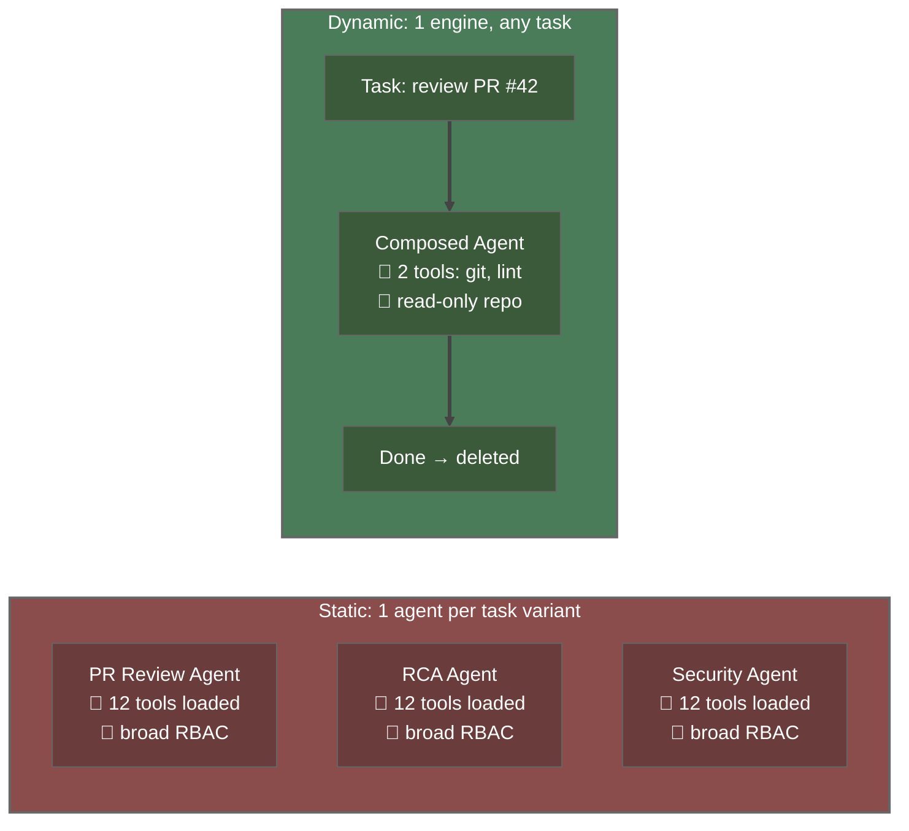

| Problem | Static Agent | Dynamic Agent |
|---------|-------------|---------------|
| **Privilege scope** | All tools loaded, broad permissions | Only tools needed for this task |
| **Attack surface** | Large (unused tools exploitable) | Minimal (nothing extra loaded) |
| **Auditability** | Hard (which tool was actually used?) | Clear (agent = one task, one audit trail) |
| **Scalability** | N agents for N task types | 1 composition engine for any task |
| **Cost** | Always running, always allocated | Ephemeral, pay only for execution |

---

## The Solution: Dynamic Agent Composition

Instead of deploying a permanent agent for every scenario, the platform
assembles the **minimum sufficient agent** at runtime from approved components:

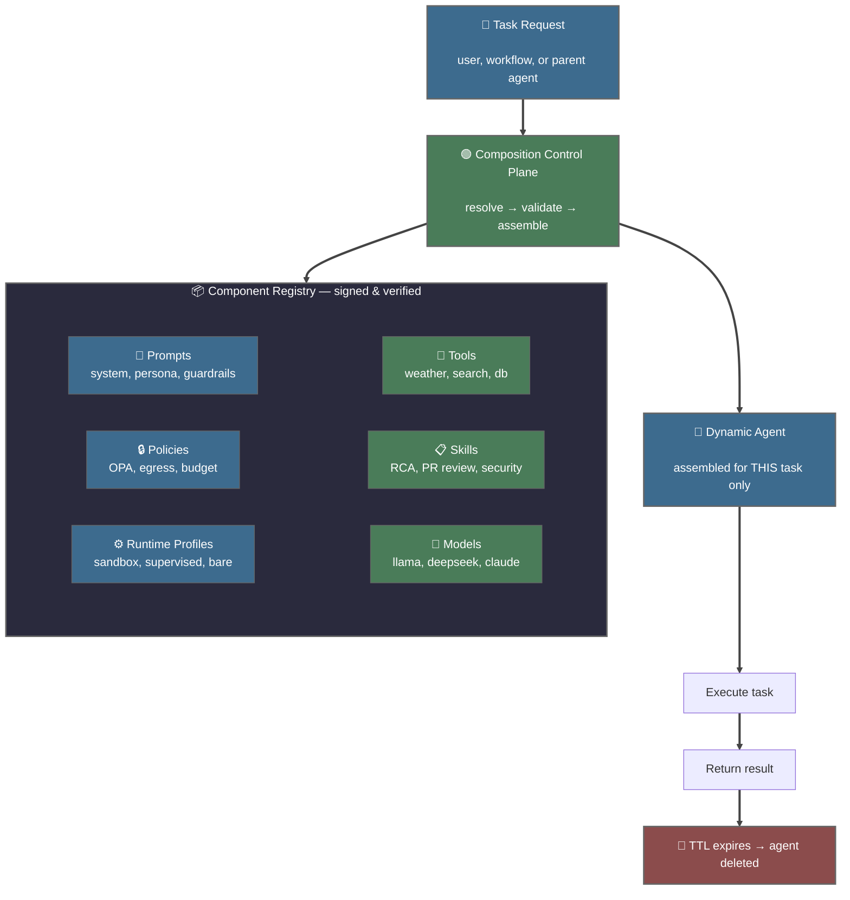

The composition control plane translates task requirements into an authorized
assembly of exactly the components needed — no more, no less.

---

## Architecture: Flat Resource Model

### Why Not Hierarchical Spawning?

Most prototypes (including Claude Code's subagents) use in-process spawning —
the parent agent creates child agents as threads or subprocesses inside its
own container. This is simple but breaks enterprise requirements:

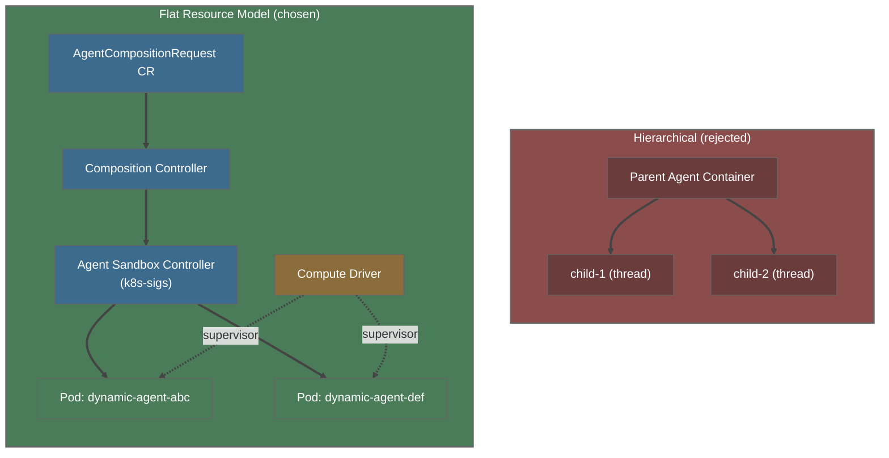

Each dynamic agent is a **separate Kubernetes pod** created by the
agent-sandbox-controller and hardened by the OpenShell compute driver
(supervisor injection), with:
- Its own ServiceAccount and RBAC
- Its own resource limits (CPU, memory, ephemeral storage)
- Its own network policy and egress rules (OPA via supervisor)
- OpenShell supervisor enforcing Landlock, seccomp, and network namespace isolation
- Full visibility in `kubectl`, monitoring, and audit logs
- TTL-based lifecycle management (no zombie accumulation)

### Control Plane Flow

Today's pod creation involves two components that must coordinate:
the **agent-sandbox-controller** (kubernetes-sigs, watches Sandbox CRs and creates
pods) and the **OpenShell compute driver** (injects supervisor init containers
via gateway Unix socket). A known race condition exists where both create
Services for the same pod (rossoctl#1581). The composition controller must
orchestrate both and handle this coordination:

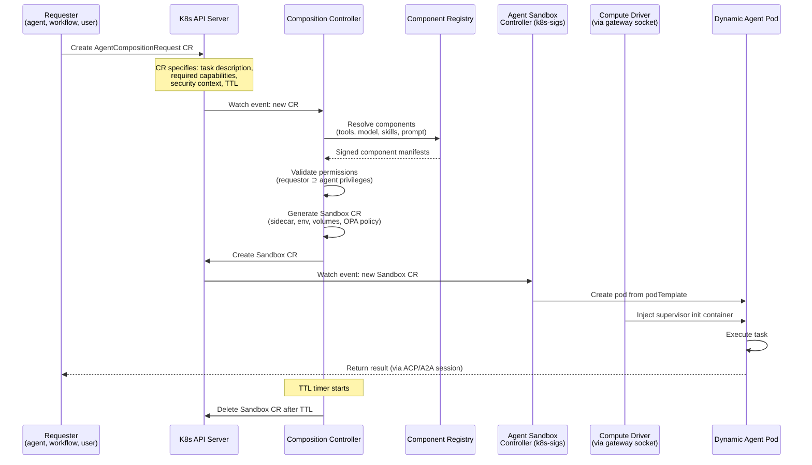

---

## Security: Least Privilege by Construction

Dynamic agents are inherently more secure than static agents because they
are assembled with **only** what the task requires:

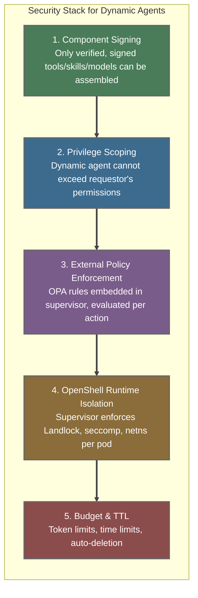

### Privilege Propagation

The critical constraint: a dynamic agent **never exceeds** the privileges
of the entity that requested it.

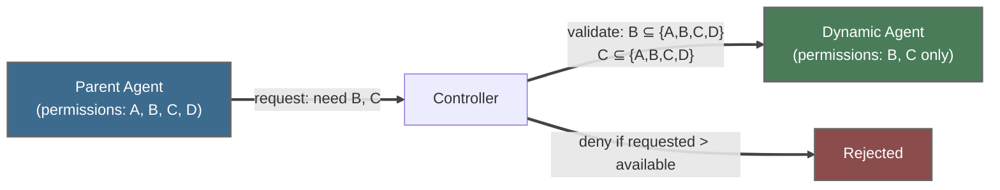

---

## Creating Dynamic Agents: The Sidecar Pattern

Different agent frameworks (Claude SDK, ADK, LangGraph, CrewAI) have
different harness requirements. A **sidecar proxy** decouples the
composition engine from framework-specific details:

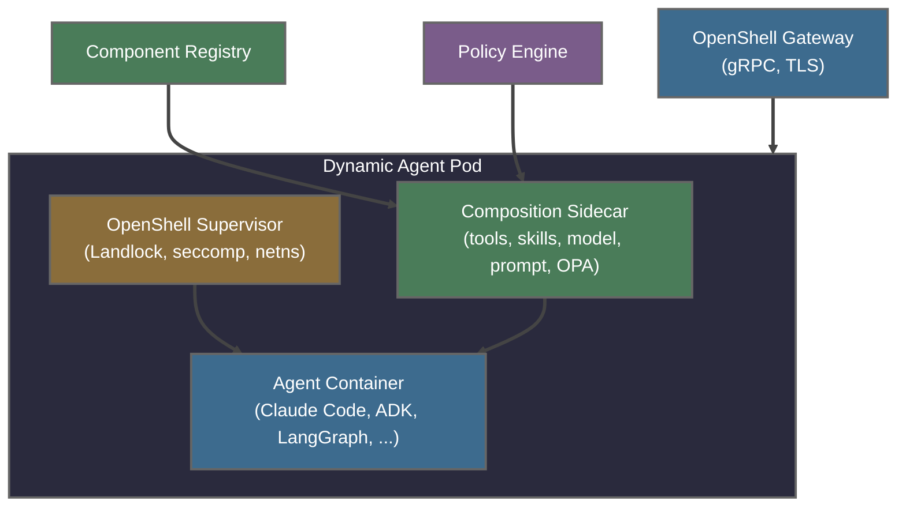

The sidecar handles:
- **Tool injection**: Mounting MCP server configs into the agent's filesystem
- **Skill loading**: Copying skill definitions to `.claude/skills/` or equivalent
- **Model routing**: Setting `OPENAI_API_BASE` / `ANTHROPIC_BASE_URL` to the correct LiteLLM endpoint
- **Prompt templating**: Injecting system prompts via environment or file mount
- **Policy composition**: Assembling OPA rules from component requirements into supervisor config

OpenShell provides the runtime foundation beneath the sidecar:
- **Gateway**: gRPC entry point with TLS, session state in SQLite, delegates to drivers via Unix socket
- **Compute driver**: Injects supervisor binary as init container into pods created by the
  agent-sandbox-controller (communicates with gateway via `/run/drivers/compute.sock`)
- **Credentials driver**: Exchanges OIDC tokens via Keycloak for sandbox authentication
- **Supervisor binary**: Injected as init container, enforces Landlock filesystem restrictions,
  seccomp syscall filtering, network namespace isolation, and embedded OPA policy evaluation
  (via `--policy-rules` and `--policy-data` flags — not a separate sidecar)
- **Sandbox base images**: Pre-built container images (`ghcr.io/nvidia/openshell-community/sandboxes/base`)
  for ad-hoc sandboxes; agent-specific images built on top for production deployments

This means the composition engine doesn't need to know how each framework
configures tools — it writes to standard paths that the sidecar translates,
while OpenShell enforces the security boundary at the kernel level.

---

## Interaction: Session-Based Protocol

All agent access — interactive (SSH/terminal) and programmatic (ACP WebSocket) —
routes through the OpenShell gateway. The Rossoctl backend bridges ACP WebSocket
to the gateway's `ExecSandbox` gRPC, providing a unified session layer with
mTLS, credential injection, and audit logging:

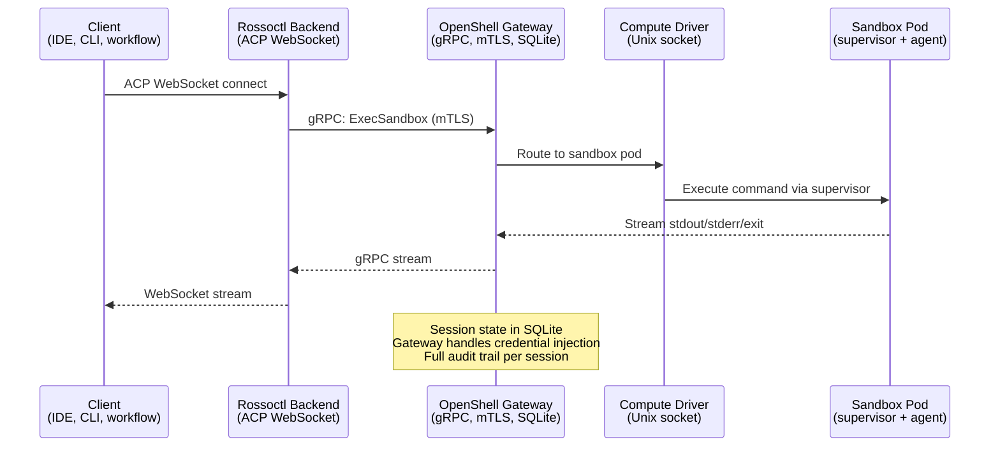

Benefits:
- Clients use session IDs, not pod names — gateway handles routing
- mTLS between backend and gateway (cert-manager managed)
- Credentials driver handles OIDC token exchange via Keycloak
- Supervisor-enforced security for all sessions
- Session state survives gateway restarts (SQLite)
- Full audit trail via gateway logs and OTel traces
- Sub-sessions can be modeled (agent creates sub-agent via new session)

---

## How This Connects to Rossoctl Today

Rossoctl already has most of the building blocks:

| Component | Exists Today | Extension for Dynamic Agents |
|-----------|-------------|------------------------------|
| **OpenShell Gateway** | gRPC session management, TLS, SQLite state | Route to dynamically composed agent pods |
| **OpenShell Compute Driver** | Injects supervisor init via gateway socket | Inject composition sidecar alongside supervisor |
| **OpenShell Credentials Driver** | OIDC token exchange via Keycloak | Scope credentials per dynamic agent identity |
| **OpenShell Supervisor** | Landlock, seccomp, netns, embedded OPA | Apply security profile from component manifest |
| **Agent Sandbox Controller** | Watches Sandbox CRs → creates pods (k8s-sigs) | Shared CRD for composition requests |
| **ACP WebSocket (Backend)** | JSON-RPC 2.0 over WebSocket, ExecSandbox gRPC | Add sub-session support for orchestrator visibility |
| **LiteLLM Proxy** | Model routing and translation | Inject per-agent model config via sidecar |
| **Feature Flags** | `rossoctl_feature_flag_*` | `rossoctl_feature_flag_dynamic_composition` |
| **Teleport Script** | Package context → sandbox | Extend to package arbitrary component sets |
| **Helm Charts** | Static agent deployment | Add dynamic agent template with sidecar |

### From Teleport to Composition

The `sandbox:teleport` skill (PR #1498) is a precursor to dynamic composition:

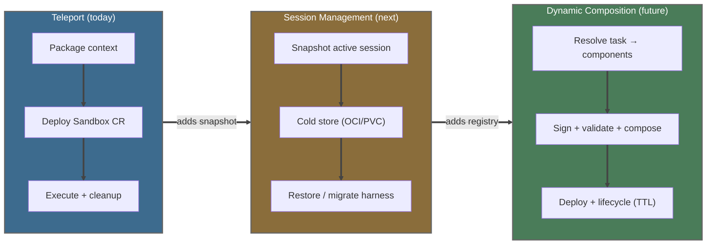

---

## Lifecycle: From Request to Deletion

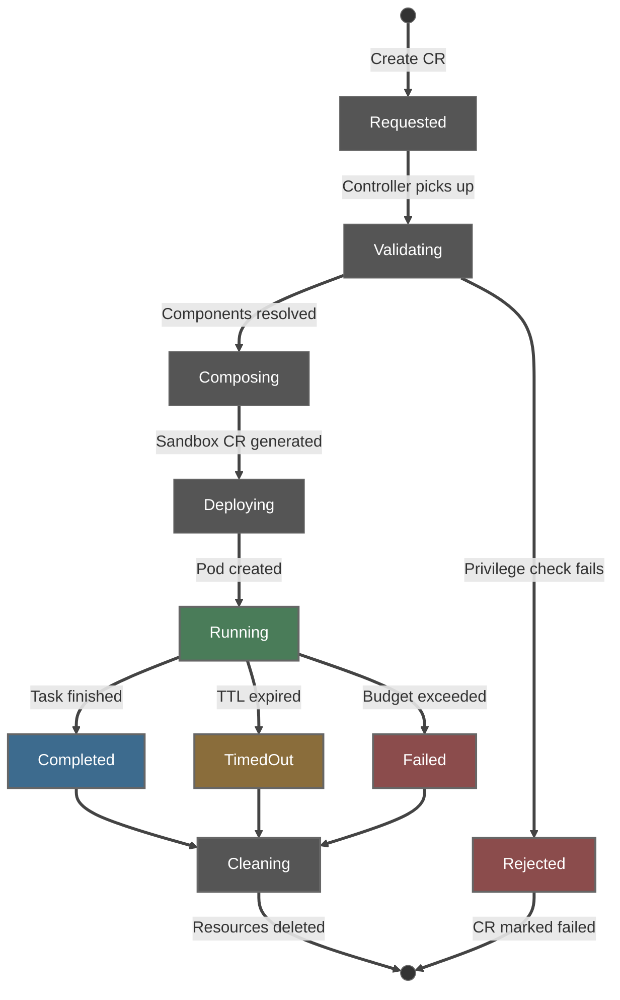

---

## Session Backup, Restore, and Migration

### The Insight: Teleport Is Bidirectional

Teleport today packages context **into** a sandbox (CLAUDE.md, skills,
settings → ConfigMap → Sandbox CR → pod). The reverse — extracting session
state **out of** a sandbox — enables powerful capabilities:

- **Cold storage**: inactive sessions don't need running pods
- **Resume from cold**: spin up a new pod, restore state, continue working
- **Cross-cluster migration**: move a session from Kind to HyperShift
- **Cross-harness migration**: start in Claude Code, continue in OpenCode or ADK

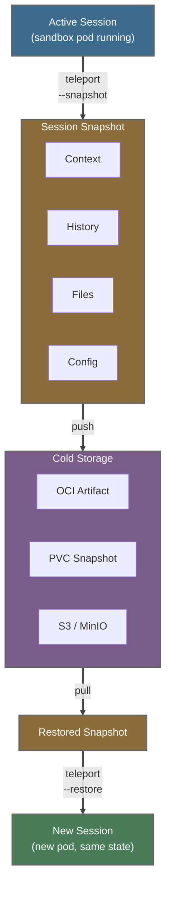

Session snapshot contents:

| Layer | What's captured |
|-------|----------------|
| **Context** | CLAUDE.md, skills, settings.json |
| **History** | Conversation turns, tool calls, results |
| **Files** | Workspace files created/modified during session |
| **Config** | Model endpoints, LiteLLM config, budget state |

### What Constitutes Session State?

| Layer | Contents | Size | Portability |
|-------|----------|------|-------------|
| **Context** | CLAUDE.md, skills, settings.json | ~10-100 KB | High (already teleported) |
| **Conversation** | Turns, tool calls, results, thinking | ~100 KB-5 MB | Medium (format varies by harness) |
| **Workspace** | Files created/modified during session | ~1 KB-100 MB | High (just files) |
| **Environment** | Model endpoints, LiteLLM config, budget state | ~1 KB | High (env vars + config) |
| **Agent memory** | `.claude/memory/`, learned preferences | ~10-50 KB | Low (harness-specific) |

Context and workspace are harness-agnostic. Conversation history is the
key challenge for cross-harness migration — it needs a portable format.

### Storage Options

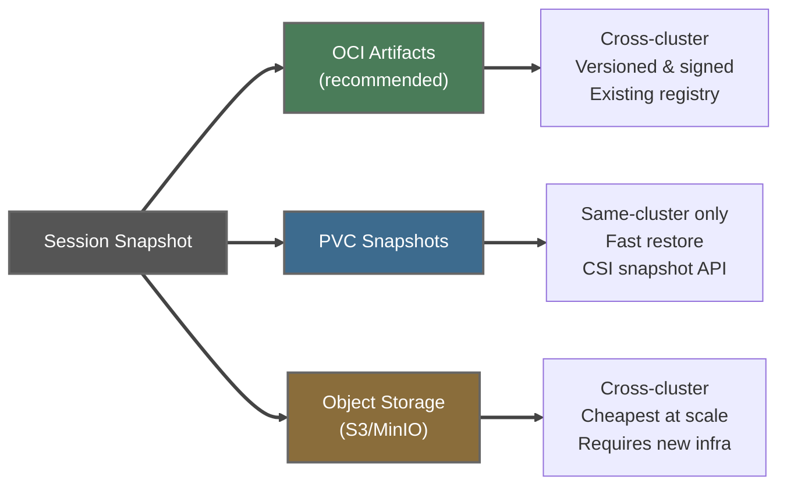

**Recommended: OCI Artifacts** as the primary format because:

1. **Registry already exists** — every K8s cluster has a container registry
2. **Signed and versioned** — aligns with the component signing principle
3. **Cross-cluster portable** — push to shared registry, pull from any cluster
4. **Fits the composition model** — a session snapshot is just another component
   in the registry, alongside tools, skills, and models
5. **Existing tooling** — `oras`, `crane`, `skopeo` all handle OCI artifacts

PVC snapshots as a **fast path** for same-cluster resume (no network transfer) —
PVC-backed workspace persistence already works today (T1.4, T2.3 tests validate
this). Object storage as a **future option** when MLflow or MinIO is already deployed.

> **Current state**: PVC workspace persistence works. Conversation state is NOT
> persisted across pod restarts (marked TODO in T2.3). OCI artifact tooling
> (oras, cosign) is not yet in the codebase — this is the primary gap to close.

### Session Lifecycle with Cold Storage

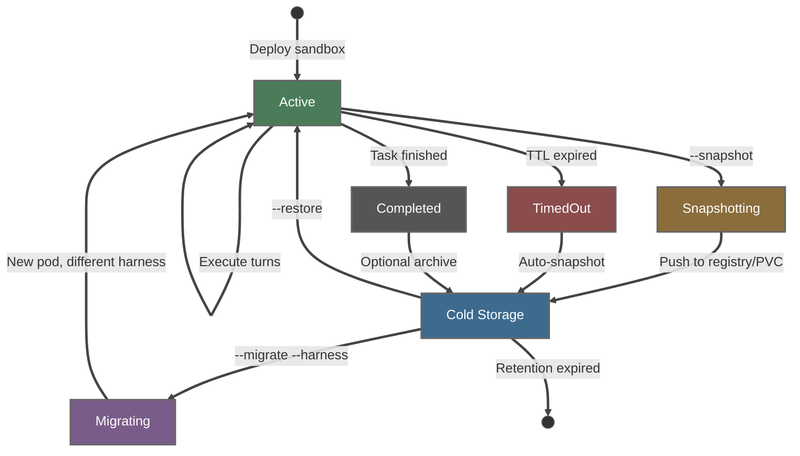

Key behaviors:
- **TTL auto-snapshot**: when a session's TTL expires, snapshot before deletion
  instead of losing state. The session can be resumed later from cold storage.
- **Explicit snapshot**: `teleport --snapshot --session <id>` at any time
- **Restore**: `teleport --restore --session <id>` creates a new pod with
  the snapshotted state — new pod name, same session content
- **Migration**: `teleport --migrate --session <id> --harness opencode`
  converts the portable session format to the target harness

### Cross-Harness Migration

The composition sidecar pattern already handles framework-specific config
injection. Migration extends this: the portable session format carries
the context and workspace, while the sidecar translates to the target
harness's conventions:

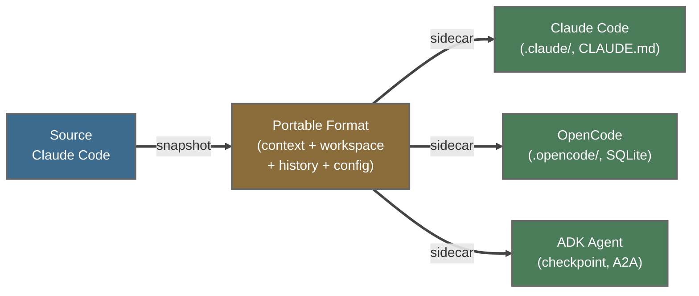

Migration layers:
1. **Context**: direct copy (CLAUDE.md, skills are harness-agnostic)
2. **Workspace**: direct copy (just files)
3. **Conversation**: needs translation (Claude Code JSON ↔ A2A turns ↔ ADK checkpoints)
4. **Memory**: best-effort (`.claude/memory/` → target format, may lose structure)

The conversation translation is the hardest part. MVP: carry context and workspace,
start a fresh conversation in the target harness with a system prompt summarizing
the prior session. Full conversation replay is a stretch goal.

---

## Design Principles

1. **Composition over configuration** — don't configure a big agent, compose a small one
2. **Flat over hierarchical** — every agent is a K8s pod (via Sandbox CR), not a subprocess
3. **External policy** — governance lives outside the agent process
4. **Signed components** — only verified tools, skills, models can be assembled
5. **Least privilege by construction** — dynamic agent gets exactly what it needs
6. **Session abstraction** — orchestrators use sessions, not pod details
7. **TTL by default** — dynamic agents are ephemeral, not persistent
8. **Observable by default** — OTel traces, structured logs, audit trail per agent

---

## Relation to graph-loop Test Matrix

The graph-loop test matrix (T0-T7) validates the infrastructure that
dynamic composition depends on:

| Tier | What It Tests | Why It Matters for Composition |
|------|--------------|-------------------------------|
| T0 | Platform health | Controller, CRDs, networking must work |
| T1 | Agent connectivity | Composed agents must be reachable |
| T2 | Multi-turn conversation | Context preservation across turns, session resume |
| T3 | Skill execution | Skills are components to compose |
| T4 | Security + tenant isolation | OPA egress policy + namespace/credential isolation |
| T5 | Backend API proxy | Single ingress for all agents |
| T6 | ACP WebSocket | Session-based communication protocol |
| T7 | Teleport | Full session teleport lifecycle — precursor to composition |

Dynamic composition and session management add new tiers:

**T8: Session Backup & Restore (next)**
- Snapshot active session → OCI artifact / PVC
- Restore from cold → new pod with same workspace and context
- TTL auto-snapshot → session preserved on expiry
- Resume from cold → conversation context available
- PVC round-trip → write, delete pod, recreate, verify data

**T9: Cross-Harness Migration (future)**
- Claude Code → OpenCode: context and workspace transfer
- Portable session format → target harness sidecar translation
- Conversation summary injection on harness switch
- Skills portability across harness conventions

**T10: Composition (future)**
- Composition request → deployment created
- Privilege scoping validated
- Component signing verified
- TTL lifecycle works
- Sub-session visibility

---

*This document extends the WIP design from the Rossoctl team. Built on
Rossoctl's existing infrastructure — OpenShell (gateway, compute driver,
credentials driver, supervisor), Agent Sandbox Controller (k8s-sigs),
ACP WebSocket bridge (ExecSandbox gRPC), LiteLLM, and the teleport MVP
from PR #1498. Session backup/restore and cross-harness migration extend
the teleport pattern into a full session lifecycle management system.*
