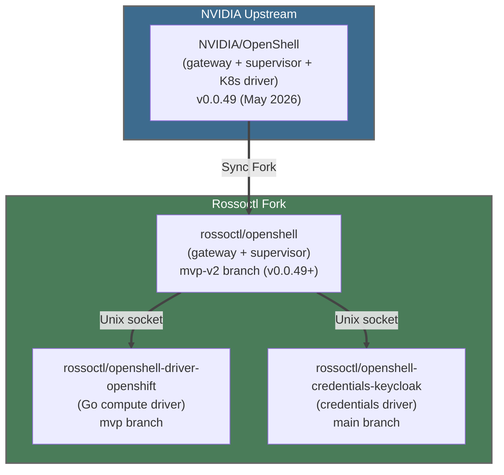
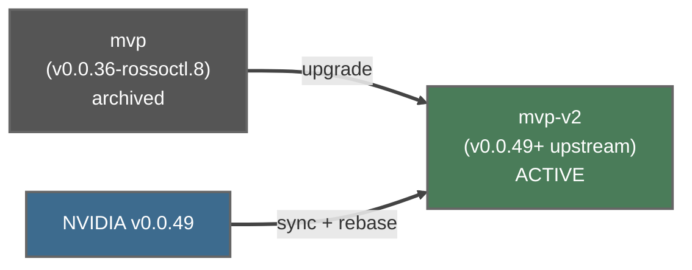

# Rossoctl OpenShell Fork: Architecture, Patches, and Upgrade Path

*Comprehensive analysis of how Rossoctl maintains and extends the
NVIDIA/OpenShell fork, what custom patches exist, and the plan for
syncing with upstream v0.0.49+.*

---

## Fork Architecture

Rossoctl maintains three repositories forked from the OpenShell ecosystem:



### Branch Strategy

| Repo | Main Branch | Build Branch | Previous Build Branch | Status |
|------|-------------|-------------|----------------------|--------|
| rossoctl/openshell | `main` (synced with NVIDIA) | **`mvp-v2`** (17 commits ahead, v0.0.49+) | `mvp` (v0.0.36-rossoctl.8) | Active |
| rossoctl/openshell-driver-openshift | `main` | `mvp` | — | Needs compat testing with mvp-v2 |
| rossoctl/openshell-credentials-keycloak | `main` | `main` | — | Compatible |

### How Builds Work

1. **Sync Fork**: GitHub "Sync Fork" button syncs `rossoctl/openshell:main` with `NVIDIA/OpenShell:main`
2. **Create mvp-v2**: Branch from synced `main`, cherry-pick rossoctl patches
3. **Fix compilation**: Resolve Rust conflicts, add missing match arms, fix clippy
4. **CI publishes**: Publish workflow on `mvp-v2` push builds gateway + supervisor images
5. **Tag format**: `mvp-v2-<sha7>` (e.g., `mvp-v2-3a1bbea`)

### Key CLI Change in v0.0.49

The gateway CLI args changed:
- **Old (v0.0.36)**: `--sandbox-namespace team1`
- **New (v0.0.49)**: `--drivers=external --compute-driver-socket=/run/drivers/compute.sock --credentials-driver-socket=/run/drivers/credentials.sock`

The `--sandbox-namespace` flag was removed. The Helm chart `statefulset.yaml`
must use the new args format.

### Current Image Tags

| Component | Image | Tag | Source |
|-----------|-------|-----|--------|
| Gateway | `ghcr.io/rossoctl/openshell/gateway` | `v0.0.56-rc.1` | v0.0.56 tag (upstream v0.0.56+) |
| Supervisor | `ghcr.io/rossoctl/openshell/supervisor` | `v0.0.56-rc.1` | v0.0.56 tag (upstream v0.0.56+) |
| Compute Driver | `ghcr.io/rossoctl/openshell-driver-openshift/compute-driver` | `v0.1.0-rc.6` | v0.1.0-rc.6 tag |
| Credentials Driver | `ghcr.io/rossoctl/openshell-credentials-keycloak/credentials-driver` | `main-d7d8306` | main branch |

> **Update (2026-06-10)**: Gateway and supervisor upgraded to `v0.0.56-rc.1`
> (from `mvp-v2-3a1bbea`). Compute driver upgraded to `v0.1.0-rc.6` with
> projected SA token support and sandbox JWT auth bootstrap. The certgen
> pre-install hook now generates TLS certificates (cert-manager Certificate
> resources removed in PR #1833). PR #1689 merged with security hardening,
> teleport/spawn, and async OIDC token fetch.

---

## Custom Patches on mvp-v2 Branch

The `mvp-v2` branch (created by pdettori, June 3 2026) carries 17 commits
on top of synced upstream `main` (v0.0.49+). These are the rebased and
fixed rossoctl patches:

### Gateway/Core Patches (mvp-v2)

| Commit | Title | Category |
|--------|-------|----------|
| `d6abdad4` | Add credentials driver client with `--credentials-driver-socket` | Core |
| `56c8ffdb` | Use native root certificates for OIDC discovery | Auth |
| `2b64b515` | Add Debug impl for CredentialsDriverHandle | Fix |
| `7d651381` | Add External arm to config_file inheritable_keys match | Fix |
| `d555d98a` | Gate tracing::debug import behind cfg(unix) in credentials module | Fix |
| `d5059da6` | Handle External variant in telemetry driver kind mapping | Fix |

### CI/Build Patches (mvp-v2)

| Commit | Title |
|--------|-------|
| `9941162f` | Trigger workflows on mvp-v2 branch |
| `f9f98b62` | Use cargo-zigbuild for musl targets and fix clippy lint |
| `9a6a0ed5` | Use correct Dockerfile paths for gateway and supervisor |
| `3a1bbea7` | Increase publish timeout to 90min for source builds |

### What Changed from mvp to mvp-v2

The old `mvp` branch (v0.0.36-rossoctl.8) had patches for:
- `--compute-driver-socket` flag — **still needed**, now in mvp-v2
- `--credentials-driver-socket` flag — **still needed**, now in mvp-v2
- SSH `/tmp` permissions fix — **check if upstream v0.0.49 includes it**
- Inference routing — **check if upstream v0.0.49 handles differently**
- Multi-arch supervisor build — **now built from upstream Dockerfiles**

### Compute Driver Patches (openshell-driver-openshift)

| PR | Title | Still needed? |
|----|-------|---------------|
| #1 | Namespace flags + tenant labels | **Yes** — multi-tenancy, not in upstream K8s driver |
| #2 | Scoped RBAC (namespace Role, not cluster-admin) | **Yes** — security, not in upstream |
| #3 | mTLS + inference routing | **Yes** — Rossoctl-specific wiring |
| #4 | Sandbox image pull policy configuration | **Yes** — Kind/HyperShift compatibility |

### Credentials Driver (openshell-credentials-keycloak)

Entirely Rossoctl-specific — exchanges OIDC tokens via Keycloak for sandbox
authentication. No upstream equivalent exists.

---

## Known Issues in Current Fork

### Issue #1647: OPA Wildcard Matching

**Symptom**: `*.svc.cluster.local` in policy doesn't match actual hostnames.

**Root cause**: OPA rego uses `glob.match()` with `.` as delimiter. Single `*`
matches one DNS label only. `*.svc.cluster.local` matches `foo.svc.cluster.local`
but NOT `litellm-model-proxy.team1.svc.cluster.local` (two labels before `.svc`).

**Status (v0.0.56)**: Upstream v0.0.49+ rego supports `**` for cross-label matching.
Verified working with v0.0.56. Our policy-data.yaml files use explicit endpoints
(not wildcards) as a belt-and-suspenders fix.

**Fixed in PR #1689**: Replaced wildcard policies with explicit service endpoints
(e.g., `litellm-model-proxy.team1.svc.cluster.local:4000`).

### Issue #1669: port vs ports Normalization

**Symptom**: Policy submitted with `ports: [8335]` (plural) reads back as
`port: 8335` (singular) from `openshell sandbox get --policy-only`.

**Root cause**: The proto defines both `port` (field 2, uint32, backwards compat)
and `ports` (field 9, repeated uint32). The gateway's response serialization
normalizes `ports` back to `port` — a **gateway serialization bug**.

**Status (mvp-v2)**: The rego evaluator correctly uses `endpoint.ports[_]` (plural).
The normalization bug (stripping `ports` → `port` on output) may be fixed in
upstream v0.0.49. **Needs verification** on mvp-v2 — test with `openshell sandbox get --policy-only`.

### Issue: glibc Compatibility

**Symptom**: Supervised agents crash with `GLIBC_2.38/2.39 not found`.

**Root cause**: Supervisor binary built against Ubuntu 24.04 (glibc 2.39),
agent Dockerfiles used `python:3.12-slim` (Debian bookworm, glibc 2.36).

**Fixed in PR #1689**: Upgraded to `python:3.13-slim` (Debian trixie, glibc 2.40).

### Issue #1815: Supervisor scratch image breaks init container (CLOSED)

**Symptom**: Supervised agents fail to start — init container crashes with
`sh: not found` or `cp: not found`.

**Root cause**: The compute driver (`openshell-driver-openshift`) creates init
containers with `command: ["sh", "-c", "cp /openshell-sandbox /opt/openshell/bin/"]`.
The mvp-v2 supervisor image is a scratch/distroless image — no shell, no cp.

**Status**: CLOSED. Agent Dockerfiles `COPY --from=supervisor` at build time,
bypassing the init container copy. Compute driver v0.1.0-rc.5+ also handles
this differently.

### Issue #1879: Helm chart fails on OpenShift (SCC + StorageClass)

**Symptom**: OpenShell deployment fails on OpenShift — certgen job rejected by
restricted-v2 SCC, StatefulSet PVC pending without default StorageClass.

**Root cause**: Chart hardcoded `runAsUser: 1000`, `fsGroup: 1000`, and
`seccompProfile: RuntimeDefault` which conflict with OpenShift's restricted-v2
SCC. StatefulSet PVC had no `storageClassName` field.

**Status**: PR #1881 open — adds values-driven `podSecurityContext`, optional
SCC template, `storageClassName` field, and namespace creation ordering fix.

### Issue: ExecSandbox vs Sandbox CRD Mismatch

**Symptom**: ExecSandbox gRPC returns `NOT_FOUND` for sandboxes created via
the Sandbox CRD (kubectl apply).

**Root cause**: The gateway's ExecSandbox looks up sandboxes in its SQLite
database. Sandboxes created via `CreateSandbox` RPC are stored there.
Sandboxes created via the Sandbox CRD (agent-sandbox-controller) are NOT
registered in the gateway's database.

**Affects**: The ACP bridge → ExecSandbox → gateway path for teleport
sandboxes. The teleport script creates sandboxes via CRD, but ExecSandbox
expects gateway-managed sandboxes.

**Status**: T6 sandbox prompt test marked xfail with full explanation.
Fix requires vendoring `CreateSandbox` proto and creating sandboxes via
the gateway RPC instead of kubectl apply.

---

## Upstream K8s Driver vs Our Compute Driver

The colleague's question: "do we still need openshell-driver-openshift now
that the kubernetes driver is in openshell upstream?"

| Feature | Upstream K8s Driver | rossoctl/openshell-driver-openshift |
|---------|--------------------|------------------------------------|
| Language | Rust (in-process with gateway) | Go (out-of-process via Unix socket) |
| CRD | `agents.x-k8s.io/v1alpha1` Sandbox | Same |
| Multi-tenancy | Single namespace | Per-tenant namespace isolation |
| RBAC | Cluster-level | Namespace-scoped Roles |
| Tenant labels | None | `openshell.ai/tenant`, `rossoctl.io/team` |
| PVC persistence | Workspace PVC per sandbox | Same |
| GPU support | Yes (preflighting) | Not tested |
| Image pull policy | Default | Configurable (IfNotPresent for Kind) |
| dtach injection | Unknown | Yes (session persistence) |
| OpenShift SCCs | No | Yes (anyuid, privileged for supervisor) |

**Verdict**: We still need our driver for **multi-tenancy** (namespace isolation,
tenant labels, scoped RBAC) and **OpenShift support** (SCCs). The upstream
driver could replace ours if we upstream the multi-tenancy features.

---

## Upgrade Status: mvp-v2 (COMPLETED)

The upgrade from v0.0.36 to v0.0.49+ is **done** via the `mvp-v2` branch,
created by pdettori on June 3, 2026.



### What Was Done

1. Synced `main` with NVIDIA upstream via GitHub "Sync Fork"
2. Created `mvp-v2` from synced `main`
3. Rebased rossoctl patches (credentials driver, External driver, OIDC)
4. Fixed Rust compilation: Debug impl, match arms, clippy lints, cfg gates
5. Updated CI workflows to trigger on `mvp-v2` branch
6. Built and published gateway + supervisor images to GHCR

### Remaining Work

| Item | Status |
|------|--------|
| Gateway + supervisor images | **DONE** — `mvp-v2-3a1bbea` |
| Helm chart args update | **DONE** — `--drivers=external` (PR #1689) |
| Compute driver compat | **Needs testing** — may need update for #1815 |
| Policy wildcards (#1647) | **Needs verification** on mvp-v2 |
| Port normalization (#1669) | **Needs verification** on mvp-v2 |
| Supervised agent init (#1815) | **Blocked** — scratch image has no shell |

### Rollback

If mvp-v2 causes issues:
```yaml
# charts/openshell/values.yaml — revert to old tags:
gateway.tag: v0.0.36-rossoctl.8
supervisorImage.tag: v0.0.36-rossoctl.8
# statefulset.yaml — revert args:
args: ["--sandbox-namespace", "team1"]
```

### Step-by-Step Procedure

**Step 1: Sync rossoctl/openshell main with NVIDIA upstream**
- Use GitHub "Sync Fork" button on rossoctl/openshell
- Branch protection prevents API sync — must use GitHub UI
- This updates `main` to NVIDIA v0.0.49+
- `mvp` is NOT affected

**Step 2: Create new branch from synced main**
```bash
cd /tmp && git clone git@github.com:rossoctl/openshell.git openshell-upgrade
cd openshell-upgrade
git checkout -b mvp-2026-05-29 origin/main
```

**Step 3: Cherry-pick rossoctl patches (9 essential patches)**

All patches verified as still needed (no upstream equivalent in v0.0.49):

| # | Commit | Description | Category |
|---|--------|-------------|----------|
| 1 | `9f830673` | `--compute-driver-socket` flag (External driver) | Gateway core |
| 2 | `136441fe` | `--credentials-driver-socket` flag + gRPC service | Gateway core |
| 3 | `906f3995` | OIDC/Keycloak JWT auth with RBAC | Gateway auth |
| 4 | `0f56d6e4` | `credentials_driver.proto` contract | Proto |
| 5 | `124128bd` | Stop SSH from overwriting `/tmp` to 0700 | Sandbox fix |
| 6 | `9a02d72e` | Ensure read_write dirs writable (mode 1777) | Sandbox fix |
| 7 | `6aef2e86` | Pass inference env vars through SSH sessions | Inference routing |
| 8 | `0dea760e` | GHCR gateway image publish workflow | CI |
| 9 | `abc24202` | Multi-arch supervisor build (amd64 + arm64) | CI |

Patches NOT cherry-picked (evaluate if upstream fixed):
- `9468139f` (portable `MetadataExt::uid()`) — minor, test if upstream compiles
- macOS CLI build fixes — platform-specific, test separately

```bash
# Cherry-pick in dependency order
git cherry-pick 0f56d6e4   # proto first
git cherry-pick 9f830673   # compute socket
git cherry-pick 136441fe   # credentials socket
git cherry-pick 906f3995   # OIDC auth
git cherry-pick 124128bd   # /tmp fix
git cherry-pick 9a02d72e   # dir permissions
git cherry-pick 6aef2e86   # inference routing
git cherry-pick 0dea760e   # CI gateway
git cherry-pick abc24202   # CI supervisor
```

**Step 4: Push test branch (not mvp)**
```bash
git push origin mvp-2026-05-29
```

**Step 5: Build test images from new branch**
- Tag: `v0.0.49-rossoctl.1-rc1`
- Build gateway + supervisor images
- Do NOT push to `:latest` tag

**Step 6: Test on Kind**
```bash
# Update rossoctl Helm chart to use new images
# In a worktree or branch of rossoctl/rossoctl:
# charts/openshell/values.yaml:
#   gateway.tag: v0.0.49-rossoctl.1-rc1
#   supervisorImage.tag: v0.0.49-rossoctl.1-rc1
```

Run full test suite:
- T0-T7 openshell tests
- T7 teleport (12 tests)
- Policy validation (#1647 wildcards)
- Port normalization (#1669)
- Agent connectivity (hermes + claude-code)

**Step 7: Create PR (mvp-2026-05-29 → mvp)**
- Only after all tests pass
- Only after v0.6.0 ships
- Include test results in PR description

**Step 8: Archive old mvp**
```bash
git branch mvp-v0.0.36-archive mvp  # preserve
git checkout mvp
git reset --hard mvp-2026-05-29     # update
git push --force-with-lease origin mvp
```

### Same process for driver repos

**openshell-driver-openshift:**
```bash
git checkout -b mvp-2026-05-29 origin/main
# Merge the 1 trailing commit from mvp
git cherry-pick <trailing-commit>
git push origin mvp-2026-05-29
```

**openshell-credentials-keycloak:**
- No branch needed — stays on `main`
- Test compatibility with v0.0.49 gateway

### Proto Compatibility

Verified: `compute_driver.proto` interface is stable between v0.0.36 and
v0.0.49. The ComputeDriver gRPC service (GetCapabilities, ValidateSandboxCreate,
GetSandbox, ListSandboxes) has no breaking changes. Existing drivers work
without modification.

### Rollback Plan

If the upgrade fails:
1. `mvp` branch was never touched (until Step 8)
2. Archive branch `mvp-v0.0.36-archive` preserves the exact state
3. Helm chart rollback: change image tags back to `v0.0.36-rossoctl.8`
4. Driver repos: same rollback pattern

### Timeline

| When | Action |
|------|--------|
| **Now** | Create `mvp-2026-05-29` branches, cherry-pick patches |
| **Now** | Build RC images, test on Kind |
| **After v0.6.0** | Create PR from `mvp-2026-05-29` → `mvp` |
| **After PR review** | Merge, tag `v0.0.49-rossoctl.1`, push images |
| **After CI green** | Update rossoctl Helm chart to new tags |

---

## Hermes Agent Integration

### Current State (v0.15.1)

Hermes is an autonomous agent framework by Nous Research. v0.15.1 supports
`custom_providers` config but has a bug where the model name isn't forwarded
to the API request body (model= empty).

### Integration Path: ACP Adapter

Hermes has a built-in ACP adapter (`hermes acp`) that needs `[acp]` pip extras:

```dockerfile
RUN pip install --no-cache-dir \
    "hermes-agent[acp] @ https://github.com/NousResearch/hermes-agent/archive/refs/tags/v2026.5.29.tar.gz"
```

This exposes hermes as an ACP-compatible agent that the Rossoctl backend can
communicate with via the ExecSandbox gRPC path or direct ACP WebSocket.

### LiteLLM Integration

Hermes needs to be configured to use our LiteLLM proxy for model routing.
The correct config for v0.15.1 uses `custom_providers`:

```yaml
model:
  default: claude-sonnet-4-20250514  # MUST use "default" not "name"
  provider: rossoctl

custom_providers:
  - name: rossoctl
    base_url: http://litellm-model-proxy.team1.svc:4000/v1
    api_key: <litellm-virtual-key>
    models:
      - claude-sonnet-4-20250514
      - vertex-claude-sonnet
      - llama-scout-17b
```

**Known bug** (NousResearch/hermes-agent#34500): `custom_providers` model
list not resolved by `provider_model_ids()`. Fixed with a patch in our
Dockerfile (`patch-custom-providers.py`). Config key must be `model.default`
(not `model.name`) — hermes reads `default` or `model` subkeys only.

---

## Vertex AI Integration

LiteLLM routes Claude models through Vertex AI using application default
credentials (ADC). Setup requires:

1. K8s Secret with ADC credentials mounted into LiteLLM pod
2. LiteLLM config with `vertex_ai/` model prefix and project/location

```yaml
# LiteLLM model config
- model_name: "claude-sonnet-4-20250514"
  litellm_params:
    model: "vertex_ai/claude-sonnet-4@20250514"
    vertex_project: "<project-id>"
    vertex_location: "us-east5"
    vertex_credentials: "/vertex-creds/credentials.json"
```

The sandbox agent only sees the LiteLLM virtual key — real Vertex AI
credentials never leave the LiteLLM pod.

---

*This document tracks the state of Rossoctl's OpenShell fork as of May 2026.
Update after each fork sync or patch evaluation.*
