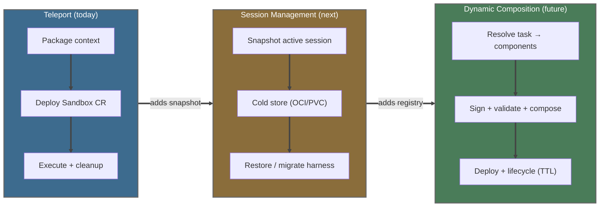
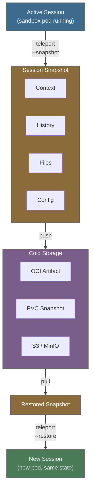
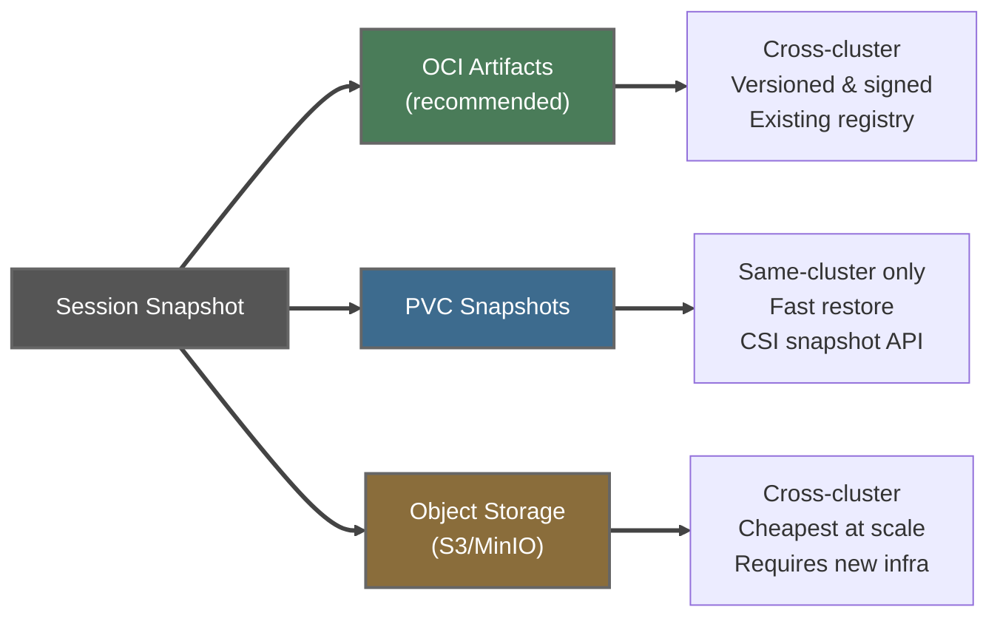
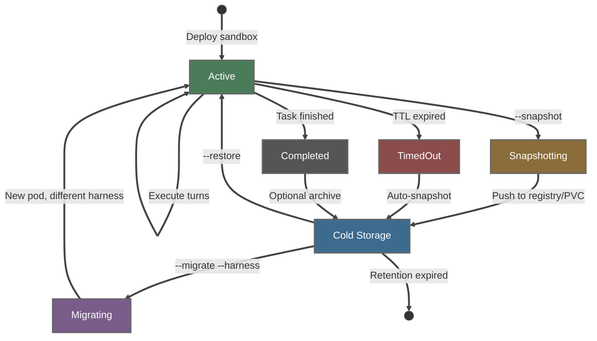
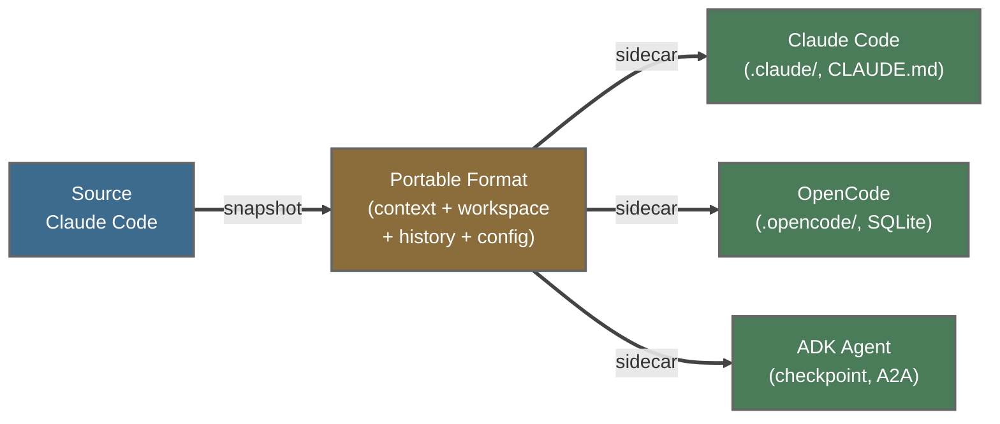

# Session Teleport & Management

*Teleport local context into sandboxes, manage session lifecycle, backup/restore
from cold storage, and migrate across agent harnesses — built on the
[Composable Agents](composable-agents-design.md) architecture.*

---

## How This Connects to Rossoctl Today

Rossoctl already has most of the building blocks for session management:

| Component | Exists Today | Extension for Session Management |
|-----------|-------------|----------------------------------|
| **OpenShell Gateway** | gRPC session management, TLS, SQLite state | Route to dynamically composed agent pods |
| **OpenShell Compute Driver** | Injects supervisor init via gateway socket | Inject composition sidecar alongside supervisor |
| **OpenShell Credentials Driver** | OIDC token exchange via Keycloak | Scope credentials per dynamic agent identity |
| **OpenShell Supervisor** | Landlock, seccomp, netns, embedded OPA | Apply security profile from component manifest |
| **Agent Sandbox Controller** | Watches Sandbox CRs → creates pods (k8s-sigs) | Shared CRD for composition requests |
| **ACP WebSocket (Backend)** | JSON-RPC 2.0 over WebSocket, ExecSandbox gRPC | Add sub-session support for orchestrator visibility |
| **LiteLLM Proxy** | Model routing and translation | Inject per-agent model config via sidecar |
| **Teleport Script** | Package context → sandbox | Extend to package arbitrary component sets |

---

## Teleport: Context Packaging and Remote Execution

Teleport packages local Claude Code context (CLAUDE.md, skills, settings)
into a Rossoctl OpenShell sandbox and executes prompts remotely with full
isolation (Landlock, seccomp, network namespace, OPA policy).

### Two Modes

| Mode | Command | Use case |
|------|---------|----------|
| **Spawn** | `--spawn` | Bare sandbox, no local context — delegate tasks remotely |
| **Teleport** | `--package` + `--deploy` | Package local context into sandbox |
| **Full** | `--full "prompt"` | All-in-one: package → deploy → prompt → cleanup |

### Credential Isolation

The sandbox never sees real API keys. LiteLLM virtual keys provide the
security boundary:

```
litellm-proxy-secret (rossoctl-system)     ← real MaaS/Vertex API keys
         │
    LiteLLM Proxy (translates + routes)
         │
litellm-virtual-keys (team1)              ← virtual key (sk-ZSFBf...)
         │
    Sandbox Pod
  └─ ANTHROPIC_AUTH_TOKEN=sk-ZSFBf...     ← only sees virtual key
  └─ ANTHROPIC_BASE_URL=http://litellm:4000
```

### From Teleport to Composition

The teleport skill (PR #1498) is a precursor to the full
[composable agents](composable-agents-design.md) architecture:



> **Full teleport usage docs**: [docs/agentic-runtime/teleport.md](../agentic-runtime/teleport.md)

---

## Session Backup, Restore, and Migration

### The Insight: Teleport Is Bidirectional

Teleport today packages context **into** a sandbox (CLAUDE.md, skills,
settings → ConfigMap → Sandbox CR → pod). The reverse — extracting session
state **out of** a sandbox — enables powerful capabilities:

- **Cold storage**: inactive sessions don't need running pods
- **Resume from cold**: spin up a new pod, restore state, continue working
- **Cross-cluster migration**: move a session from Kind to HyperShift
- **Cross-harness migration**: start in Claude Code, continue in OpenCode or ADK



### What Constitutes Session State?

| Layer | Contents | Size | Portability |
|-------|----------|------|-------------|
| **Context** | CLAUDE.md, skills, settings.json | ~10-100 KB | High (already teleported) |
| **Conversation** | Turns, tool calls, results, thinking | ~100 KB-5 MB | Medium (format varies by harness) |
| **Workspace** | Files created/modified during session | ~1 KB-100 MB | High (just files) |
| **Environment** | Model endpoints, LiteLLM config, budget state | ~1 KB | High (env vars + config) |
| **Agent memory** | `.claude/memory/`, learned preferences | ~10-50 KB | Low (harness-specific) |

Context and workspace are harness-agnostic. Conversation history is the
key challenge for cross-harness migration — it needs a portable format.

### Storage Options



**Recommended: OCI Artifacts** as the primary format because:

1. **Registry already exists** — every K8s cluster has a container registry
2. **Signed and versioned** — aligns with the component signing principle
3. **Cross-cluster portable** — push to shared registry, pull from any cluster
4. **Fits the composition model** — a session snapshot is just another component
   in the registry, alongside tools, skills, and models
5. **Existing tooling** — `oras`, `crane`, `skopeo` all handle OCI artifacts

PVC snapshots as a **fast path** for same-cluster resume (no network transfer) —
PVC-backed workspace persistence already works today (T1.4, T2.3 tests validate
this). Object storage as a **future option** when MLflow or MinIO is already deployed.

> **Current state**: PVC workspace persistence works. Conversation state is NOT
> persisted across pod restarts (marked TODO in T2.3). OCI artifact tooling
> (oras, cosign) is not yet in the codebase — this is the primary gap to close.

### Session Lifecycle with Cold Storage



Key behaviors:
- **TTL auto-snapshot**: when a session's TTL expires, snapshot before deletion
  instead of losing state. The session can be resumed later from cold storage.
- **Explicit snapshot**: `teleport --snapshot --session <id>` at any time
- **Restore**: `teleport --restore --session <id>` creates a new pod with
  the snapshotted state — new pod name, same session content
- **Migration**: `teleport --migrate --session <id> --harness opencode`
  converts the portable session format to the target harness

### Cross-Harness Migration

The [composition sidecar pattern](composable-agents-design.md#creating-dynamic-agents-the-sidecar-pattern)
already handles framework-specific config injection. Migration extends this:
the portable session format carries the context and workspace, while the
sidecar translates to the target harness's conventions:



Migration layers:
1. **Context**: direct copy (CLAUDE.md, skills are harness-agnostic)
2. **Workspace**: direct copy (just files)
3. **Conversation**: needs translation (Claude Code JSON ↔ A2A turns ↔ ADK checkpoints)
4. **Memory**: best-effort (`.claude/memory/` → target format, may lose structure)

The conversation translation is the hardest part. MVP: carry context and workspace,
start a fresh conversation in the target harness with a system prompt summarizing
the prior session. Full conversation replay is a stretch goal.

---

## Test Matrix

The graph-loop test matrix (T0-T7) validates the infrastructure that
session management depends on:

| Tier | What It Tests | Why It Matters |
|------|--------------|----------------|
| T0 | Platform health | Controller, CRDs, networking must work |
| T1 | Agent connectivity | Composed agents must be reachable |
| T2 | Multi-turn conversation | Context preservation across turns, session resume |
| T3 | Skill execution | Skills are components to compose |
| T4 | Security + tenant isolation | OPA egress policy + namespace/credential isolation |
| T5 | Backend API proxy | Single ingress for all agents |
| T6 | ACP WebSocket | Session-based communication protocol |
| T7 | Teleport | Full session teleport lifecycle — precursor to composition |

Session management and composition add new tiers:

**T8: Session Backup & Restore (next)**
- Snapshot active session → OCI artifact / PVC
- Restore from cold → new pod with same workspace and context
- TTL auto-snapshot → session preserved on expiry
- Resume from cold → conversation context available
- PVC round-trip → write, delete pod, recreate, verify data

**T9: Cross-Harness Migration (future)**
- Claude Code → OpenCode: context and workspace transfer
- Portable session format → target harness sidecar translation
- Conversation summary injection on harness switch
- Skills portability across harness conventions

**T10: Composition (future)**
- Composition request → deployment created
- Privilege scoping validated
- Component signing verified
- TTL lifecycle works
- Sub-session visibility

---

*This document covers the implementation layer for session management.
For the underlying composable agents architecture — flat resource model,
security stack, sidecar pattern, and design principles — see
[Composable Agents Design](composable-agents-design.md).*
