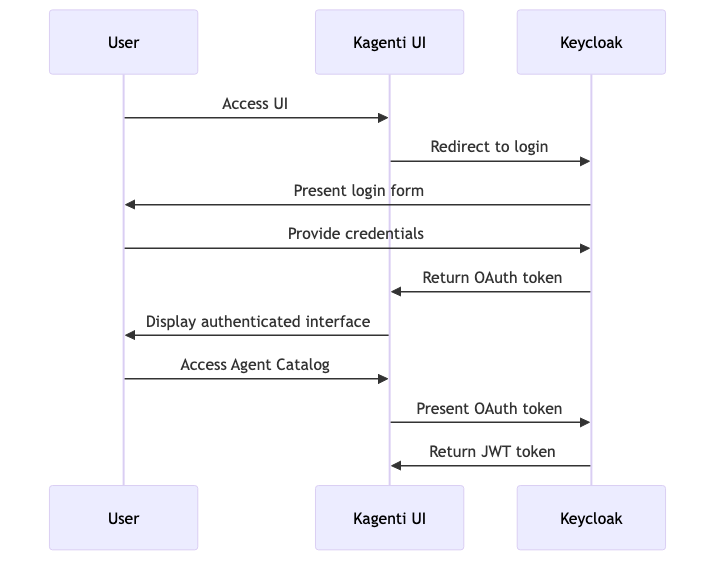
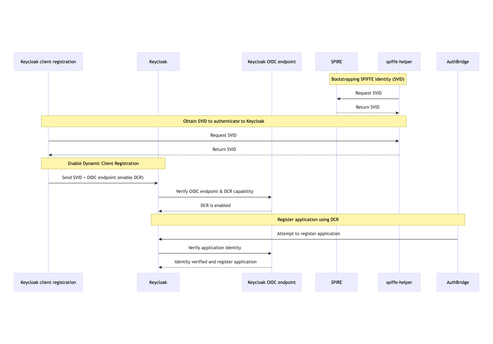
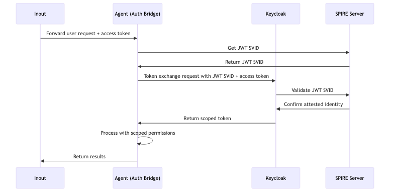
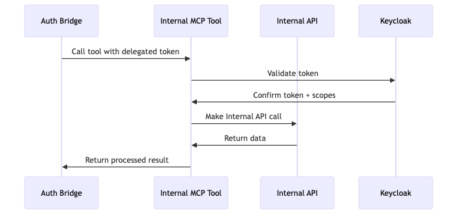
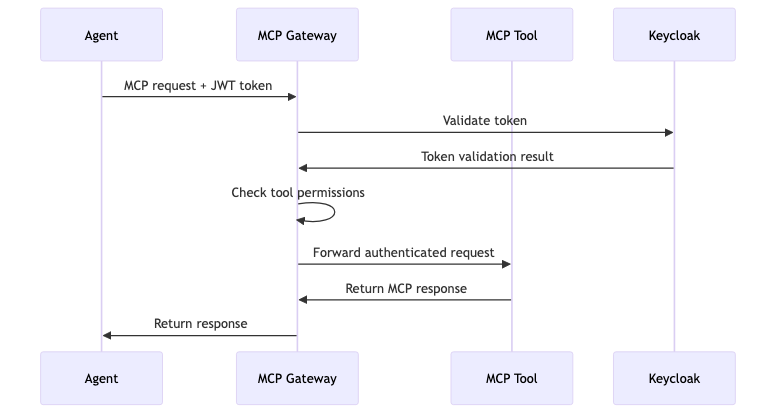
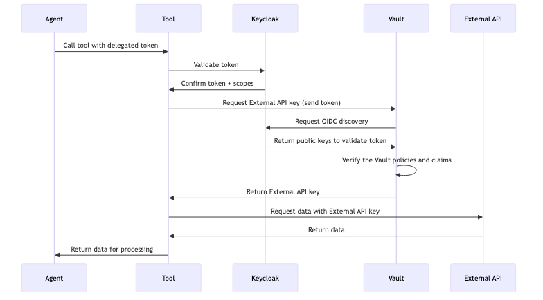

These are the six flows that make up authentication and delegation in Rossoctl, from a user logging in
to an agent reaching an external API on that user's behalf.

Diagram sources are in
[`docs/diagrams/`](https://github.com/rossoctl/rossoctl/tree/main/docs/diagrams) as Mermaid files, with
PNG and SVG renders alongside for slides.

## 1. User authentication

A user logs in to the console. Keycloak runs the OIDC authorization-code flow and issues an access
token.



```
POST /realms/rossoctl/protocol/openid-connect/token
Content-Type: application/x-www-form-urlencoded

grant_type=authorization_code
&client_id=rossoctl-ui
&code=<auth_code>
&redirect_uri=http://rossoctl-ui.localtest.me:8080/callback
```

```json
{
  "access_token": "eyJ0eXAiOiJKV1Q...",
  "token_type": "Bearer",
  "expires_in": 600,
  "scope": "openid profile email",
  "id_token": "eyJ0eXAiOiJKV1Q..."
}
```

The user's token carries their roles:

```json
{
  "sub": "user-123",
  "preferred_username": "slack-full-access-user",
  "aud": "rossoctl-ui",
  "roles": ["slack-full-access", "slack-partial-access"],
  "exp": 1735689600
}
```

## 2. Client registration

Before a workload can obtain tokens it must exist as a Keycloak client. The operator's
client-registration controller handles this — see
[AuthBridge](authbridge.md#client-registration). There is no user-facing step.



## 3. Agent token exchange

The agent needs to call a tool as the user. Its sidecar exchanges the user's token for one scoped to
that tool, authenticating the exchange with the agent's own SPIFFE JWT.



```
POST /realms/rossoctl/protocol/openid-connect/token
Authorization: Bearer <JWT-SVID-of-the-agent>
Content-Type: application/x-www-form-urlencoded

grant_type=urn:ietf:params:oauth:grant-type:token-exchange
&subject_token=<user-token>
&subject_token_type=urn:ietf:params:oauth:token-type:access_token
&audience=slack-tool
&client_id=spiffe://localtest.me/ns/team/sa/slack-researcher
```

```json
{
  "access_token": "eyJ0eXAiOiJKV1Q...",
  "token_type": "Bearer",
  "expires_in": 300,
  "scope": "slack-partial-access"
}
```

The exchanged token names the user as subject and the agent as actor:

```json
{
  "sub": "user-123",
  "act": { "sub": "spiffe://localtest.me/ns/team/sa/slack-researcher" },
  "aud": "slack-tool",
  "scope": "slack-full-access",
  "exp": 1735686900
}
```

Note the lifetime: 300 seconds against the user token's 600. Delegated tokens are shorter-lived than
what they came from.

## 4. Internal tool access

The agent calls the tool with the exchanged token. The tool's sidecar validates it and confirms the
audience is itself.



A tool can also check the user's permissions itself, from the token's scopes — useful when one tool
exposes operations at different privilege levels:

```python
def validate_request(request):
    token = request.headers.get("Authorization", "").replace("Bearer ", "")
    resp = requests.get(
        "http://keycloak.keycloak.svc.cluster.local:8080"
        "/realms/rossoctl/protocol/openid-connect/userinfo",
        headers={"Authorization": f"Bearer {token}"},
    )
    if resp.status_code != 200:
        raise AuthenticationError("Invalid token")

    scopes = resp.json().get("scope", "").split()
    if "slack-full-access" in scopes:
        return PermissionLevel.FULL
    if "slack-partial-access" in scopes:
        return PermissionLevel.PARTIAL
    raise AuthorizationError("Insufficient permissions")
```

## 5. Through the MCP Gateway

When tools are reached through the MCP Gateway, the gateway sits in the path.



```
POST /mcp
Host: mcp-gateway.localtest.me:8080
Authorization: Bearer <token>
Content-Type: application/json

{ "method": "tools/list", "params": {} }
```

:::warning
Most authentication and authorization in the gateway is **not yet implemented**. Keep per-workload
enforcement enabled — do not treat the gateway as your boundary. See
[MCP Gateway](../workloads/mcp-gateway.md).
:::

## 6. External API access

When a tool must call an external API, it needs a real third-party credential — and the agent must not
hold it. The delegated token is presented to a secret store, which returns the external API key.



The agent's authority ends at the tool. The external credential never enters the agent.

## Standards

| Standard | Used for |
| --- | --- |
| [RFC 8693](https://tools.ietf.org/html/rfc8693) | OAuth2 token exchange — the delegation mechanism. |
| [RFC 7523](https://tools.ietf.org/html/rfc7523) | JWT client assertions — SPIFFE authentication to Keycloak. |
| [RFC 7519](https://tools.ietf.org/html/rfc7519) | JSON Web Tokens. |
| [SPIFFE](https://spiffe.io/docs/latest/spiffe-about/spiffe-concepts/) | Workload identity. |
| [OpenID Connect Core](https://openid.net/specs/openid-connect-core-1_0.html) | User authentication. |
